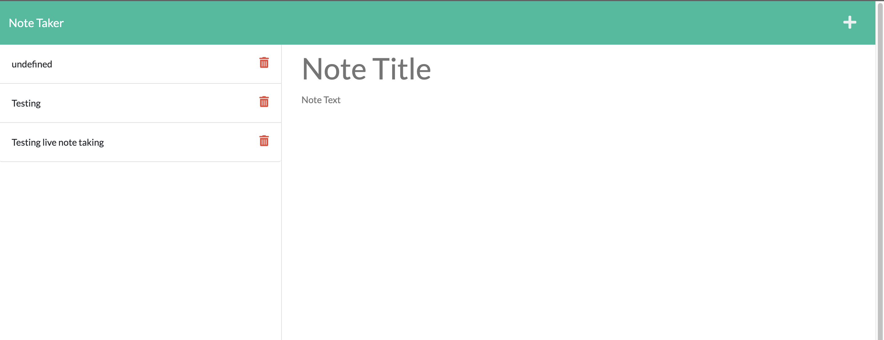

  # theNoteTaker  
   Link to Live Page: https://cryptic-woodland-58195.herokuapp.com/  
  ## Table-Of-Contents 

  * [Description](#description)
  * [Installation](#installation)
  * [Usage](#usage)
  * [Contributing](#contributing)
  * [Screenshot](#screenshot)

  ## Description

  The note taking app will allow you take notes and save them to revisit at a later time! 

  ## Installation

  In order to install theNoteTaker, first clone the repo. Then you will need the NPM packages: Express, fs, nanoid.

  ## Usage

  Once you have the repo installed, navigate to the page via your local server, or visiting this deployed page on Heroku as an example. https://cryptic-woodland-58195.herokuapp.com/  
  When you are on the site, click on "get started" and you will be taken to the page that will give you the option to create a new note, or visit previously taken notes! 

  ## Contributing 

  NPM Packages: Express, fs, Nanoid

  ## Screenshot 
   
   
   

